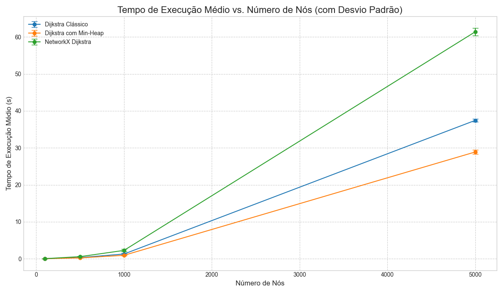
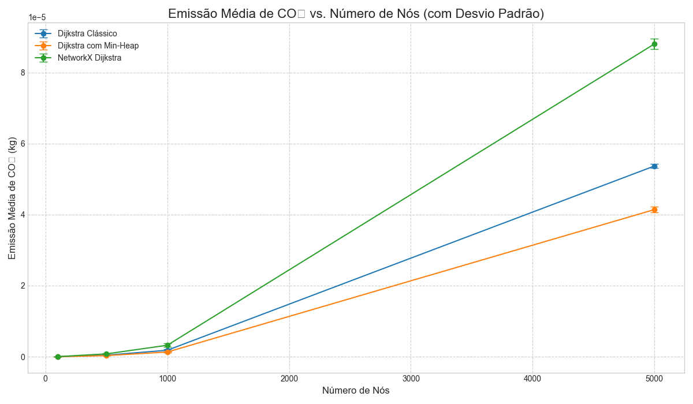

## Análise de Eficiência e Emissão de CO₂ do Algoritmo de Dijkstra
Este repositório contém um estudo experimental em Python que compara a performance (tempo de execução) e a pegada de carbono (emissões de CO₂) de duas implementações do algoritmo de Dijkstra: a versão __Clássica__ ( $O(V^2)$ ) e a versão otimizada com __Min-Heap__ ( $O(E \log V)$ ).

O objetivo é quantificar não apenas a eficiência computacional, mas também o impacto ambiental de cada abordagem ao escalar o tamanho do problema (número de nós no grafo). As emissões de carbono são rastreadas usando a biblioteca [CodeCarbon](https://codecarbon.io/).

## 📊 Índice
* [Contexto](#-contexto)
* [Metodologia Experimental](#-metodologia-experimental)
* [Resultados](#-resultados)
    * [Tempo de execução](#tempo-de-execução)
    * [Pegada de carbono](#pegada-de-carbono-co)
    * [Tabela de resultados](#tabela-de-resultados)
* [Tecnologias Utilizadas](#️-tecnologias-utilizadas)
* [Como reproduzir o experimento](#-como-reproduzir-o-experimento)

## 🎯 Contexto
 O algoritmo de Dijkstra é um pilar fundamental na teoria dos grafos para encontrar os caminhos mais curtos em um grafo ponderado. Embora a complexidade assintótica seja bem conhecida ( $O(V^2)$ ) para a implementação com array e $O(E \log V)$ ou $O(E + V \log V)$ para implementações com Min-Heap), este projeto busca:
 
 1. __Validar empiricamente__ a diferença de performance em tempo de execução.
 
 1. __Quantificar o custo energético__ e a pegada de carbono associados a cada implementação, um aspecto crucial na "Computação Verde" (Green Computing).
 
 1. Usar a função nativa do ```networkx``` como um *baseline* de referência.

## 🔬 Metodologia Experimental
O script principal (```main.py```) executa o seguinte processo:
1. __Geração de Grafos__: Grafos ponderados, não direcionados e conectados são gerados usando ```networkx```. O tamanho dos grafos (número de nós) varia em uma escala definida (ex: de 100 até 100.000 nós, ou o máximo suportado pela máquina).
1. __Seleção de Fontes__: Para cada grafo gerado, 5 nós são escolhidos aleatoriamente para servirem como nó de origem (source) para o cálculo dos caminhos mínimos.
1. __Execução dos Algoritmos__: Para cada um dos 5 nós de origem, o caminho mais curto para todos os outros nós é calculado usando três métodos:
    * __Dijkstra Clássico__: Implementação que busca o nó de menor distância em um array ou lista ($O(V^2)$).
    * __Dijkstra com Min-Heap__: Implementação otimizada usando a estrutura de dados ```Minimal Heap``` ($O(E \log V)$).
    * __Referência (NetworkX)__: A função ```nx.shortest_path_length()``` como base de comparação.
1. __Robustez Estatística__: O experimento (passos 2 e 3) é repetido 20 vezes para cada tamanho de grafo, trocando os 5 nós de origem a cada repetição para garantir uma amostragem robusta.
1. __Coleta de Métricas__: Para cada execução individual, as seguintes métricas são registradas:
    * __Tempo de Execução (s)__: Medido com a biblioteca ```time```.
    * __Emissões de CO₂ (kg)__: Estimadas e rastreadas pela biblioteca ```CodeCarbon```.
1. __Análise e Visualização__: Os dados coletados são processados com ```pandas``` para calcular as médias e os __Intervalos de Confiança de 95%__ para o tempo e as emissões. Os resultados são então plotados com ```matplotlib``` e salvos em tabelas.

## 📈 Resultados
Os resultados demonstram a clara superioridade da implementação com Min-Heap, tanto em eficiência de tempo quanto em sustentabilidade (menor emissão de CO₂).

### Tempo de Execução



Como esperado pela análise de complexidade, o tempo de execução da versão clássica ($O(V^2)$) cresce quadraticamente, tornando-se inviável rapidamente. A versão com Min-Heap ($O(E \log V)$) escala de forma muito mais eficiente, apresentando um desempenho próximo ao da função otimizada do ```networkx```.

### Pegada de Carbono (CO₂)



As emissões de CO₂ estão diretamente correlacionadas com o tempo de execução e o consumo de energia da CPU/GPU. A ineficiência do algoritmo clássico se traduz diretamente em um maior gasto energético e, consequentemente, uma maior pegada de carbono para resolver o mesmo problema.

### Tabela de Resultados

A tabela abaixo resume os resultados médios para os grafos testado.

| Nós | Algoritmo | Tempo médio (s) | Desvio padrão (s) | CO₂ Médio (kg) | Desvio padrão (kg) |
| --- | --------- | --------------- | ----------------- | -------------- | ------------------ |
| 100 | Dijkstra clássico | 0.009 | 0.004 | $1.47*10^{-8}$ | $5.67*10^{-9}$ |
| 100 | Dijkstra com Min-Heap | 0.007 | 0.003 | $1.11*10^{-8}$ | $4.84*10^{-9}$ |
| 100 | NetworkX Dijkstra | 0.07 | 0.003 | $2.42*10^{-8}$ | $4.92*10^{-9}$ |
| 500 | Dijkstra clássico | 0.31 | 0.052 | $4.4*10^{-7}$ | $7.42*10^{-8}$ |
| 500 | Dijkstra com Min-Heap | 0.22 | 0.034 | $3.23*10^{-7}$ | $4.97*10^{-8}$ |
| 500 | NetworkX Dijkstra | 0.57 | 0.11 | $7.99*10^{-7}$ | $1.61*10^{-7}$ |
| 1000 | Dijkstra clássico | 1.27 | 0.21 | $1.82*10^{-6}$ | $3.02*10^{-7}$ |
| 1000 | Dijkstra com Min-Heap | 0.92 | 0.13 | $1.31*10^{-6}$ | $1.81*10^{-7}$ |
| 1000 | NetworkX Dijkstra | 2.25 | 0.32 | $3.22*10^{-6}$ | $4.64*10^{-7}$ |
| 5000 | Dijkstra clássico | 37.43 | 0.38 | $5.37*10^{-5}$ | $5.47*10^{-7}$ |
| 5000 | Dijkstra com Min-Heap | 28.88 | 0.55 | $4.14*10^{-5}$ | $7.91*10^{-7}$ |
| 5000 | NetworkX Dijkstra | 61.40 | 1.04 | $8.81*10^{-5}$ | $1.49*10^{-6}$ |

## 🛠️ Tecnologias Utilizadas
* __Python 3.x__
* __NetworkX__: Para geração e manipulação de grafos.
* __Pandas__: Para manipulação e análise dos dados.
* __Matplotlib__: Para a visualização dos resultados.
* __CodeCarbon__: Para rastreamento das emissões de CO₂.
* __NumPy__: Para cálculos numéricos e estatísticos.
* __SciPy (opcional)__: Para o cálculo dos intervalos de confiança.

## 🚀 Como Reproduzir o Experimento
1. __Clone o repositório__: 
    ```
    git clone https://github.com/Enio-Antonio/dijkstra-comparison.git
    ```
1. __Crie um ambiente virtual (Recomendado)__:
    ```
    python -m venv .venv
    ./.venv/Scripts/Activate.ps1
    ```
1. __Instale as dependências__:
    ```
    pip install -r requirements.txt
    ```
1. __Execute o script de análise__:
    ```
    python main.py
    ```
1. __Verifique os resultados__: Os gráficos serão salvos na pasta ```resultados/``` e as tabelas serão salvas em arquivos ```.csv```.
